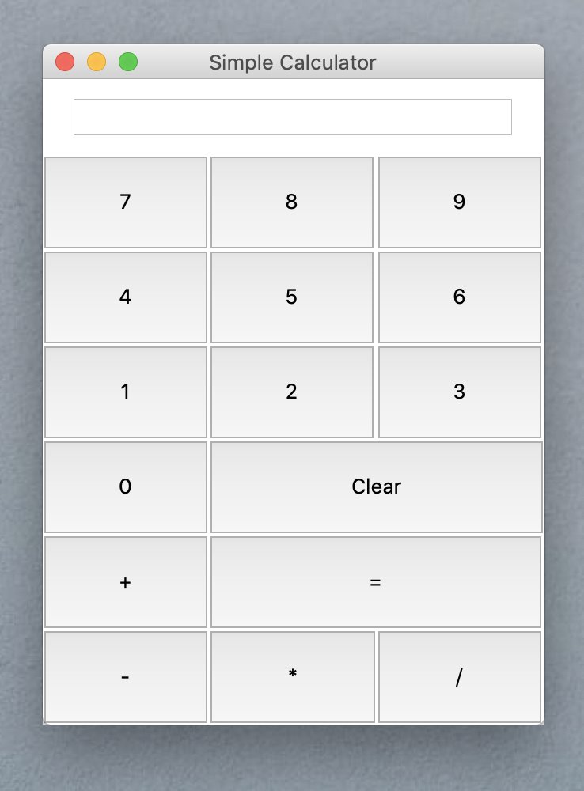

# Simple Python 3 Calculator

This project is a simple calculator written in Python.
## Getting Started

These instructions will get you a copy of the project up and running on your local machine for development and testing purposes. See deployment for notes on how to deploy the project on a live system.

### Prerequisites

Check if Python is installed
```
python3
```

### Installing

A step by step series of examples that tell you how to get a development env running

Clone Repo
```
git clone https://github.com/szrdr/simple-calculator-python.git
```

Go to the project directory
```
cd simple-calculator-python
```

Open app.py
```
python3 app.py
```

After starting, the program should look like this:


## Built With

* Python 3.8
* tkinter

## Authors

* Maciej Szreder

## License

This project is licensed under the MIT License


